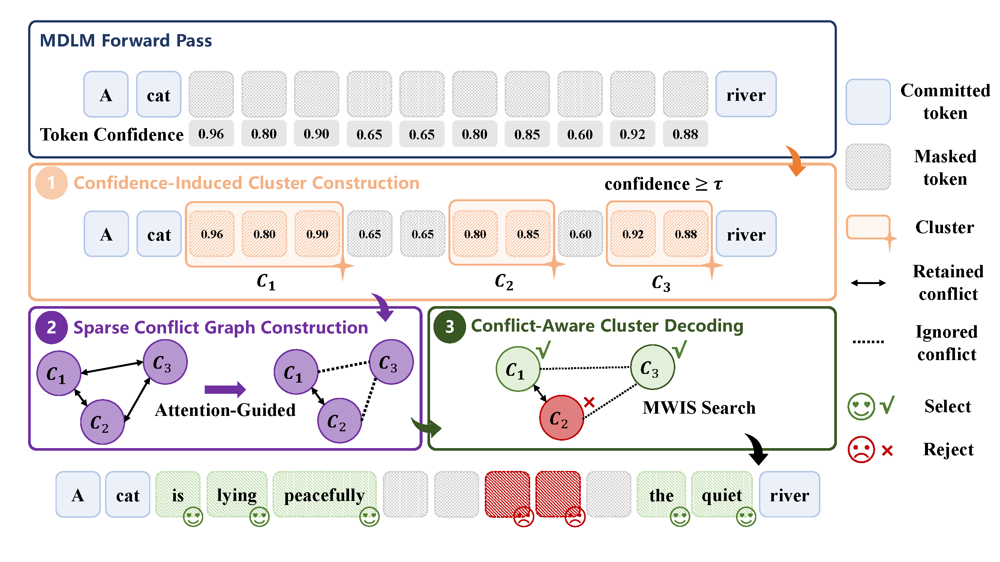

# Cluster-Level Attention-Guided Parallel Decoding for Masked Diffusion Language Models

<p align="center">
  <a href="https://arxiv.org/abs/2605.29607">
    
  </a>
</p>

<p align="center">
  
</p>

## 🚀 Introduction

We propose **CLAD**, a training-free parallel decoding method for masked diffusion language models.

CLAD speeds up MDLM inference by moving the decoding unit from individual tokens to reliable spans. At each denoising step, it groups neighboring high-confidence masked positions into cluster-level candidates, then uses attention information from the same forward pass to avoid committing strongly dependent clusters together.


## 🔧 Quick Start

```bash
git clone https://github.com/ziyigu2004/CLAD.git
cd CLAD

conda create -n CLAD python=3.10
conda activate CLAD

pip install -r requirements.txt
```

## ✨ Eval

We provide evaluation scripts for the main experiments. You can reproduce the results directly with the following commands.

For **LLaDA** models:

```bash
cd llada

# LLaDA-8B-Instruct
bash eval_instruct.sh

# LLaDA-1.5
bash eval_15.sh
```

For **Dream** models:

```bash
cd dream

# Dream-v0-Instruct-7B
bash eval_instruct.sh

# Dream-v0-Base-7B
bash eval_base.sh
```

The experiments cover both mathematical reasoning and code generation benchmarks, including **GSM8K**, **MATH**, **MBPP**, and **HumanEval**.

CLAD shows strong decoding efficiency across different masked diffusion language models and benchmarks, achieving substantial speedups over Vanilla decoding while maintaining comparable task accuracy in most settings.

<p align="center">
  
</p>

## 🎓 Citation

Thank you for citing our work if you find this repository helpful!

```bibtex
@misc{qi2026clad,
      title={Cluster-Level Attention-Guided Parallel Decoding for Masked Diffusion Language Models}, 
      author={Heqiang Qi and Wei Huang and Mingyuan Bai and Xiangming Meng},
      year={2026},
      eprint={2605.29607},
      archivePrefix={arXiv},
      primaryClass={cs.LG},
      url={https://arxiv.org/abs/2605.29607}, 
}
```

## 🙏 Acknowledgements

We would like to thank the authors of LLaDA, Dream, Fast-dLLM, KLASS, DAPD, and DAWN for their excellent work and open-source contributions. We also thank the maintainers of the evaluation benchmarks and toolkits used in this project.
